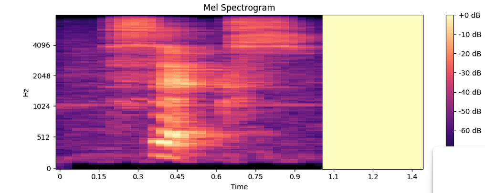
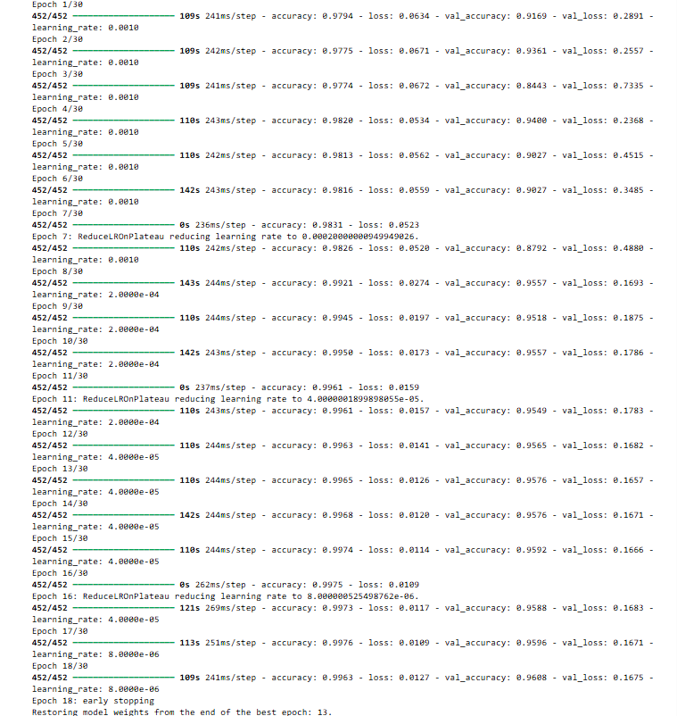

# 🎙️ Voice Digit Recognition

### 📂 Dataset Source
**This project uses the Free Spoken Digit Database (FSDD).** Download the dataset here: [Kaggle - Free Spoken Digit Database](https://www.kaggle.com/datasets/subhajournal/free-spoken-digit-database/data)

---

[](https://www.python.org/)
[](https://www.tensorflow.org/)
[](https://www.kaggle.com/datasets/subhajournal/free-spoken-digit-database/data)

An end-to-end Deep Learning pipeline that classifies spoken digits (0-9) by converting raw audio signals into visual patterns.

---

## 🧠 Project Overview
This project demonstrates how **Convolutional Neural Networks (CNNs)** can be applied to audio processing. By transforming `.wav` files into **Mel-Spectrograms**, we treat sound classification as an image recognition problem.
* **Smart Preprocessing:** Uses `Librosa` to generate 128-band Mel-Spectrograms with fixed-length padding.
* **Robust Training:** Utilized `EarlyStopping` and `ReduceLROnPlateau` to restore the best weights from **Epoch 13**.

---

## 📊 Visualizing the Logic

### 1. From Sound to Image
The CNN "sees" the intensity and frequency of the voice to determine the digit.


*Example output of the Mel-Spectrogram generation used in this project.*

### 2. Training Performance
The logs below show the training progress and the point where the best model weights were saved.



---

## 🛠️ Setup & Installation

### 1. Repository Structure
Keep the following structure to ensure the pathing in the notebook works correctly:
```text
.
├── zero/ ... nine/     # Digit folders (place .wav files here)
├── .gitignore          # Configured to ignore .wav files
├── README.md           # Project documentation
├── requirements.txt    # Library dependencies
└── Untitled.ipynb      # Main Project Notebook

```

### 2. Installation

Install the necessary libraries:

```bash
pip install -r requirements.txt

```

### 3. Data Organization

After downloading from Kaggle, place the audio files in their respective digit folders (`/zero`, `/one`, etc.). The model expects the raw data to be organized this way to train and validate properly.
